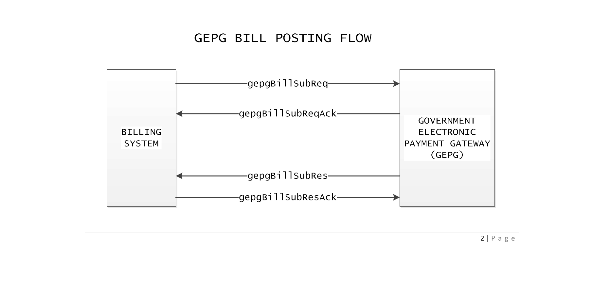
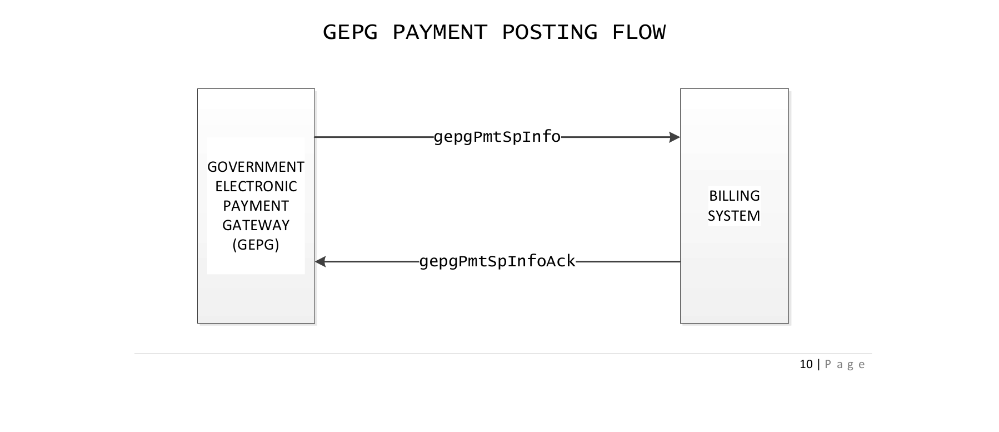
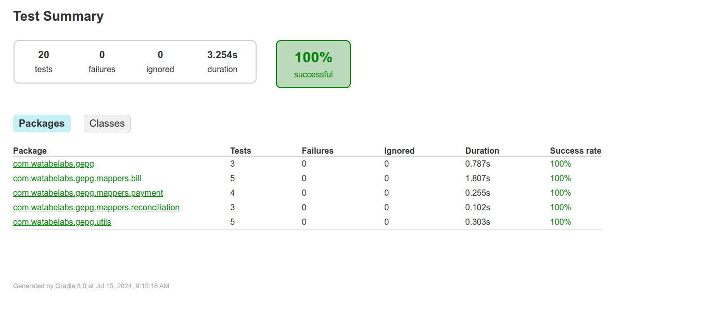

[](https://coveralls.io/github/zechtz/gepg-java?branch=main)

# GePG Java Library

A Java library for GePG integration, [Check out the wiki](https://github.com/zechtz/gepg-java/wiki) from more info

## Motivation

Integrating with GePG often requires writing repetitive code. This library simplifies the process, handling all the complex aspects for you, so you can focus on developing robust software.

## Installation instructions

### For Gradle

You need to generate a github token, [read more here](https://docs.github.com/en/authentication/keeping-your-account-and-data-secure/managing-your-personal-access-tokens), after getting your github token, create a github.properties file in the
root of your project (don't forget to .gitignore this file), the file content should look like this

```
gpr.usr=useaname
gpr.key=ghp_pTheRestofyourtoken
```

#### Then add the following to your gradle.build file

```
def githubProperties = new Properties()
if (rootProject.file("github.properties").exists()) {
    githubProperties.load(new FileInputStream(rootProject.file("github.properties")))
}

repositories {
    mavenCentral()
    maven {
     url = uri("https://maven.pkg.github.com/zechtz/gepg-java")
     credentials {
        username = githubProperties['gpr.usr'] ?: System.getenv("GITHUB_ACTOR")
        password = githubProperties['gpr.key'] ?: System.getenv("GITHUB_TOKEN")
    }
  }
}

dependencies {
    implementation 'com.watabelabs:gepg:1.0-SNAPSHOT'
}
```

### For maven

**Step 1: Configure settings.xml**

Edit the settings.xml file (usually located in ~/.m2/settings.xml) create one it it doesn't exist

**Step 2: Add this in your settings.xml**

```
<settings>
    <servers>
        <server>
            <id>github</id>
            <username>username</username>
            <password>ghp_pTheRestofyourtoken</password>
        </server>
    </servers>
</settings>
```

**Step 3: Add this to your pom.xml**

```
<repositories>
    <repository>
        <id>github</id>
        <url>https://maven.pkg.github.com/zechtz/gepg-java</url>
    </repository>
</repositories>

<dependency>
    <groupId>com.watabelabs</groupId>
    <artifactId>gepg</artifactId>
    <version>1.0-SNAPSHOT</version>
</dependency>
```

## Using the library

To use this library first you need to create a .env file at the root of your
project then install the dotenv-java library

**For Maven**

```
<dependency>
    <groupId>io.github.cdimascio</groupId>
    <artifactId>dotenv-java</artifactId>
    <version>2.2.0</version>
</dependency>
```

**For Gradle**

```
implementation 'io.github.cdimascio:dotenv-java:2.2.0'
```

**Then add the following to your .env**

```
PRIVATE_KEYSTORE_PATH=../test-keys/private-key.pfx
PUBLIC_KEYSTORE_PATH=../test-keys/public-key.pfx
PRIVATE_KEYSTORE_PASSWORD=passpass
PUBLIC_KEYSTORE_PASSWORD=passpass
PRIVATE_KEY_ALIAS=gepgclient
PUBLIC_KEY_ALIAS=gepgclient
KEYSTORE_TYPE=PKCS12
SIGNATURE_ALGORITHM=SHA1withRSA
GEPG_CODE=SP19988
SP_CODE=SP19988
SUB_SP_CODE=1001
SUB_SP_GFS_CODE=1000
SYSTEM_ID=SYSTT000
GFS_CODE=140100
GFS_CODE2=140200
API_URL=http://localhost:3005
```

## Features

This library exposes all possible requests and responses to and from GePG.

### Data Mapping DTOs

#### For Billing

**Requests**(`com.watabelabs.gepg.mappers.bill.requests`)

-   `GepgBillCanclReq`
-   `GepgBillControlNoReuse`
-   `GepgBillHdr`
-   `GepgBillItem`
-   `GepgBillSubReq`
-   `GepgBillTrxInf`

**Responses**(`com.watabelabs.gepg.mappers.bill.responses`)

-   `GepgBillCanclResp`
-   `GepgBillSubResp`

**Acks**(`com.watabelabs.gepg.mappers.bill.acks`)

-   `GepgBillSubReqAck`
-   `GepgBillSubResAck`
-   `GepgBillSubRespAck`

#### For Payments

**Requests**(`com.watabelabs.gepg.mappers.payment.requests`)

-   `GepgPmtSpInfo`
-   `GepgPymtTrxInf`

**Acks**(`com.watabelabs.gepg.mappers.payment.acks`)

-   `GepgOlPmtNtfSpInfoAck`
-   `GepgPmtSpInfoAck`

#### For Reconciliation

**Requests**(`com.watabelabs.gepg.mappers.reconciliation.requests`)

-   `GepgReconcBatchInfo`
-   `GepgReconcTrans`
-   `GepgReconcTrxInf`

**Responses**(`com.watabelabs.gepg.mappers.reconciliation.responses`)

-   `GepgSpReconcRespAck`

**Acks**(`com.watabelabs.gepg.mappers.reconciliation.acks`)

-   `GepgSpReconcResp`

All these DTOs conform to the GePG specification, eliminating the need to maintain your own DTOs.

## API

## Methods

### The GepgApiClient class exposes the following methods

-   **Submiting Requests to Gepg**

    -   `submitBill(String signedRequestXml)`: This method submits a bill to the GePG API, the
        method takes a signed xml string as a parameter and returns an instance of the `GepgBillSubReqAck` class
    -   `reuseControlNumber(String signedRequest)`: This method submits a control number reuse request to the GePG API and respond by returning an instance of the `GepgBillSubReqAck` class
    -   `updateBill(String signedRequest)`: This method submits a bill change/update request to the GePG API and respond by returning an instance of the `GepgBillSubReqAck` class
    -   `cancelBill(String signedRequest)`: This method submits a bill change/update request to the GePG API and responds by returning an instance of the `GepgBillSubReqAck` class
    -   `submitPayment(String signedRequest)`: This method Submits a payment to the GePG API and responds by returning an instance of the `GepgPmtSpInfoAck` class
    -   `requestReconciliation(String signedRequest)`: This method Submits a reconciliation request to the GePG API and responds by returning an instance of the `GepgSpReconcRespAck` class

-   **Publishing to RabbitMQ**

    -   `publishBill(submitBillString signedRequestXml)`: This method publishes a bill submission request to the RabbitMQ queue

    -   `publishBillUpdate(String signedRequest)`: This method publishes a bill change/update request to the RabbitMQ queue.

    -   `publishBillCancellation(String signedRequest)`: This method publishes a bill cancellation request to the RabbitMQ queue.

    -   `publishPayments(String signedRequest)`: This method publishes a payment submission request to the RabbitMQ queue

    -   `publishReconciliation(String signedRequest)`: This Publishes a reconciliation request to the RabbitMQ queue.

-   **Generating Acknowledgements**

    -   `generateResponseAck(T instance)`: This method takes an instance of one of the Ack classes and generate a signed Ack to return back to Gepg, Here are the ack class instances that can be passed
        -   GepgBillSubRespAck
        -   GepgBillSubResAck
        -   GepgPmtSpInfoAck
        -   GepgOlPmtNtfSpInfoAck
        -   GepgSpReconcRespAck

-   **Helpers**

    -   `signMessage(String xmlString, Class<T> clazz)`: method that adds a signature to your payload. This method returns a signed xml string of the clazz type.
    -   `convertToJavaObject(String xmlString, Class<T> clazz)`: this method converts an xml string into a JAXB-annotated object an returns it
    -   `parseToXml(Object object)`: this method takes a java JAXB-annotated object and converts it into an xml string and returns it without an xml declaration
    -   `parseToXml(Object object, true)`: this method takes a java JAXB-annotated object and a boolean flag and converts it into an xml string and returns it with an xml declaration, this is the xml declartion `<?xml version="1.0" encoding="UTF-8" standalone="yes"?>`
    -   `generatePayload(Object object)`: this method takes a java JAXB-annotated object converts it into an xml string, signs it and returns it, It is a combination of the `parseToXml` and the `signMessage` methods

-   **DateTime Helpers**
    -   `getFutureDateTimeInDays(int days)`: this method takes an int (days) and return a datetime string in the future (days) from now in the format (`2017-03-25T14:30:12`)
    -   `getPastDateTimeInDays(int days)`: this method takes an int (days) and return1 a datetime string in the past (days) from now in the format (`2017-03-25T14:30:12`)
    -   `getCurrentDateTime()`: this method returns current datetime string in in the format (`2017-03-25T14:30:12` )

## Usage Example

**NOTE:** - **All bill ids are String**

### Bill Submission



```java
public void submitBill() throws Exception {

    // instantiate the apiClient
    GepgApiClient gepgApiClient = new GepgApiClient();

    // create the GepgBillSubReq object and populate it with data
    GepgBillSubReq billSubRequestMapper = createBillSubReq();

    // convert it to an xml string
    String billXml = gepgApiClient.parseToXml(billSubReq);

    // sign the message
    String signedXml = gepgApiClient.signMessage(billXml, GepgBillSubReq.class);

    // submit Bill to Gepg
    GepgBillSubReqAck gepgBillSubResp = gepgApiClient.submitBill(signedXml);

    // check the response received from Gepg
    log.info("Bill Submission responses:{}", gepgBillSubResp);
 }
```

**Generating Bill Submission Request Object**(`populate this with actual bill
data`)

```
private static GepgBillSubReq createBillSubReq() {
    // instantiate the apiClient
    GepgApiClient gepgApiClient = new GepgApiClient();

    GepgBillHdr billHdr = new GepgBillHdr("SP023", true);
    GepgBillItem item1 = new GepgBillItem("788578851", "N", 7885.0, 7885.0, 0.0, "140206");
    GepgBillItem item2 = new GepgBillItem("788578852", "N", 7885.0, 7885.0, 0.0, "140206");

    GepgBillTrxInf billTrxInf = new GepgBillTrxInf(
            "11ae8614-ceda-4b32-aa83-2dc651ed4bcd", "2001", "tjv47", 7885.0, 0.0, gepgApiClient.getFutureDateTimeInDays(15), formatter), "Palapala",
            "Charles Palapala",
            "Bill Number 7885", gepgApiClient.getCurrentDateTime(), "100", "Hashim",
            "0699210053",
            "charlestp@yahoo.com",
            "TZS", 7885.0, true, 1, Arrays.asList(item1, item2));

    return new GepgBillSubReq(billHdr, billTrxInf);
}

```

**For Control Number Reuse** (we use the same dtos as the bill submission request with the only difference that, the `GepgBillTrxInf` Dto has an extra parameter `payCntrNum`, which you can just set using the `setPayCntrNum(String controlNumber)` method everything else stays the same)

```

    private static GepgBillControlNoReuse createBillControlNoReuse() {
        GepgBillHdr billHdr = new GepgBillHdr("SP023", true);
        GepgBillItem item1 = new GepgBillItem("788578851", "N", 7885.0, 7885.0, 0.0, "140206");
        GepgBillItem item2 = new GepgBillItem("788578852", "N", 7885.0, 7885.0, 0.0, "140206");

        GepgBillTrxInf billTrxInf = new GepgBillTrxInf(
                "11ae8614-ceda-4b32-aa83-2dc651ed4bcd", "2001", "tjv47", 7885.0, 0.0,
                gepgApiClient.getFutureDateTimeInDays(10), "Palapala",
                "Charles Palapala",
                "Bill Number 7885", gepgApiClient.getCurrentDateTime(), "100", "Hashim",
                "0699210053",
                "charlestp@yahoo.com",
                "TZS", 7885.0, true, 1, Arrays.asList(item1, item2));

        billTrxInf.setPayCntrNum("990239121373");

        return new GepgBillControlNoReuse(billHdr, billTrxInf);
    }
```

### Receiving Control Number

**This is the callback url you will provide to GePG so that they can send control numbers to your system, here we are using Springboot Rest API**

```
@PostMapping(value = "/submit-control-numbers")
@Transactional
public String postGepgBillSubResps(@RequestBody String xml) throws Exception {
    return billService.receiveControlNumber(xml);
}
```

**The service method that will handle the request**

```
@Override
public String receiveControlNumber(String gepgBillSubReqRespXml) throws Exception {
    // instantiate the api client
    GepgApiClient gepgApiClient = new GepgApiClient();

    // convert the xml string into a readable java object
    GepgBillSubResp gepgBillSubResp = gepgApiClient.receiveControlNumber(gepgBillSubReqRespXml);

    // probably use this data to update control number and message to bill

GepgBillSubRespAck gepgBillSubRespAck = new GepgBillSubRespAck();
    // respond by returning the signed response the ack xml
    return gepgApiClient.generateResponseAck(gepgBillSubRespAck);
}

```

### Receiving Payment Notifications

**This is the callback url you will provide to GePG so that they can send payment notifications to your system, again, we are using Springboot Rest API**

```
@PostMapping(value = "/submit-payment-notifications")
@Transactional
public String receivePaymentNotifications(@RequestBody String xml) throws Exception {
    return billService.receiveControlNumber(xml);
}
```

**The service method that will handle the request from the rest API**

```
@Override
public String receivePaymentNotifications(String responseXml) throws Exception {
    GepgApiClient gepgApiClient = new GepgApiClient();

    // convert this into an a readable java object
    GepgPmtSpInfo gepgPaymentSpInfo = gepgApiClient.receivePaymentNotification(responseXml);

    // do something with the payment info
    // eg. update payment
    // set payment status

    // return the acknowledgement
    return gepgApiClient.generateResponseAck(new GepgPmtSpInfoAck());
}

```

## Posting Payments



**1. generate the payload**

```
    private static GepgPmtSpInfo createPaymentSpInfo() {
        // Creating and populating the Payment Transaction Information

        GepgPymtTrxInf pymtTrxInf = new GepgPymtTrxInf(
                "TRX123456", // trxId
                "SP001", // spCode
                "PAYREF123456", // payRefId
                "74c7c4ee-b9d1-4a90-bb71-c999b7b6b09c", // billId
                "PAYCTR123456", // payCtrNum
                1000.0, // billAmt
                1000.0, // paidAmt
                "1", // billPayOptString (corresponds to FULL payment option)
                "TZS", // CCy
                "2022-01-01T12:00:00", // trxDtTm
                "MOBILE", // usdPayChn
                "255712345678", // pyrCellNum
                "JohnDoe", // pyrName
                "johndoe@example.com", // pyrEmail
                "PSPREC123456", // pspReceiptNumber
                "PSPName", // pspName
                "CTRACC123456" // ctrAccNum
        );
        // Creating and populating the Payment Service Provider Information
        GepgPmtSpInfo pmtSpInfo = new GepgPmtSpInfo(pymtTrxInf);

        return pmtSpInfo;
    }

```

**2. create the method to submit payment**

```
    public void submitPayment() throws Exception {
        // Create a sample message
        GepgPmtSpInfo gepgPmtSpInfo = createPaymentSpInfo();

        // Convert to XML string
        String message = gepgApiClient.parseToXml(gepgPmtSpInfo);

        // sign the message
        String signeXml = gepgApiClient.signMessage(message);

        // submit payment and receive ack from Gepg
        GepgPmtSpInfoAck ack = gepgApiClient.submitPayment(signedXml);

        // check the response status & update your data, maybe also log it here
        log.info("Payment Submission Response from Gepg:{}", ack);
    }

```

## Test Coverage Results



## Contributing

I welcome contributions! If you want to contribute to this project, please fork the repository and create a pull request with your changes. Make sure to follow the existing code style and include tests for your changes, if you find this library helpful, don't forget to star the project.

## License

This project is licensed under the MIT License. See the LICENSE file for details
